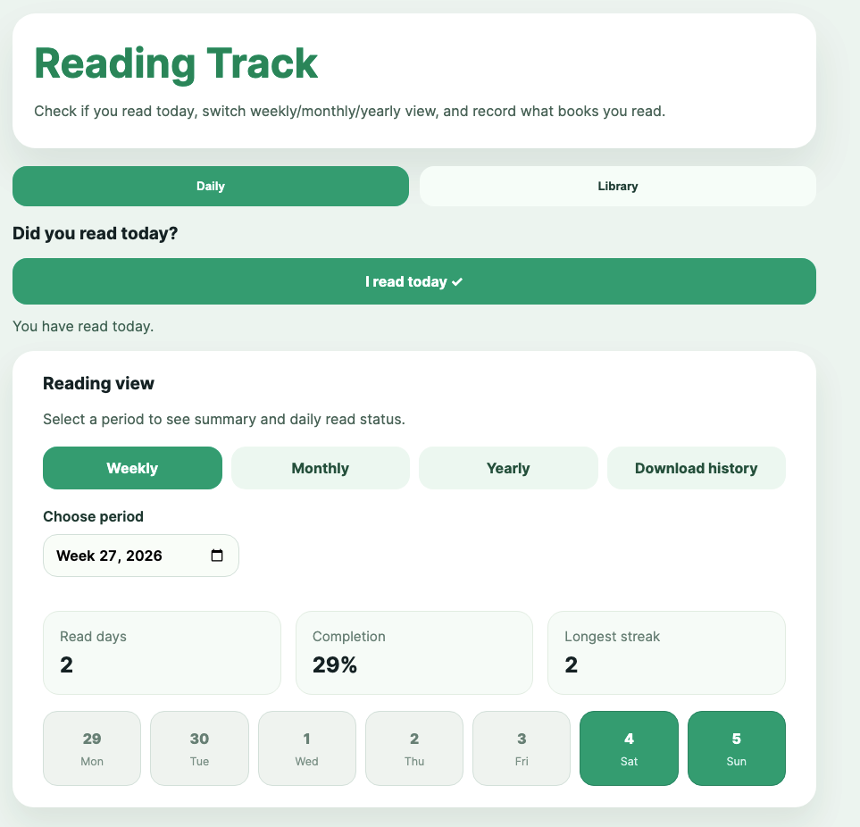
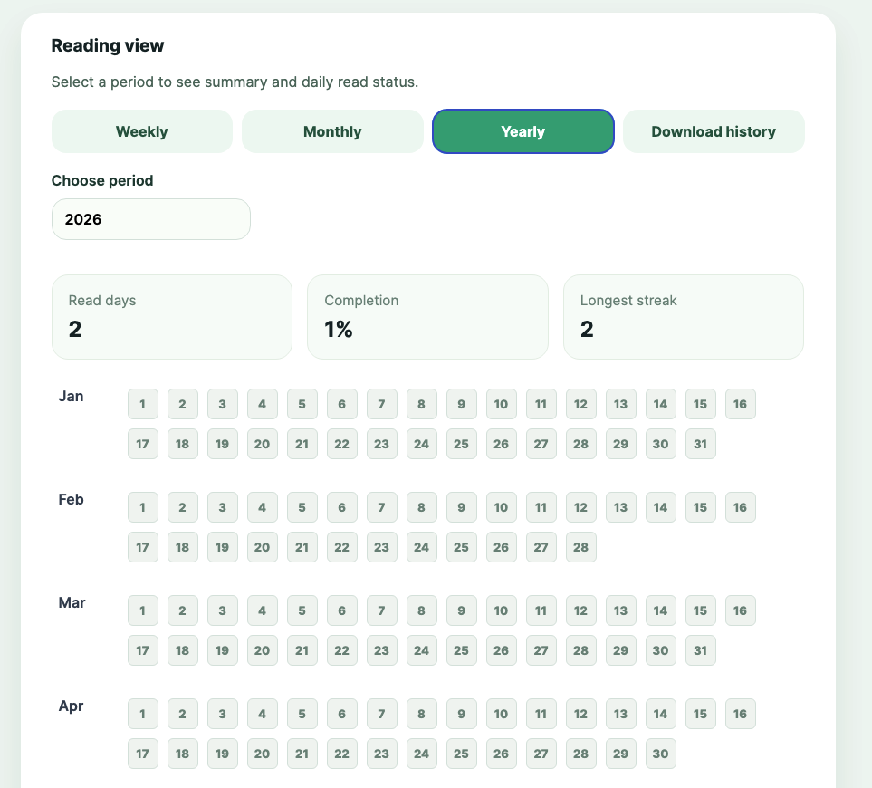
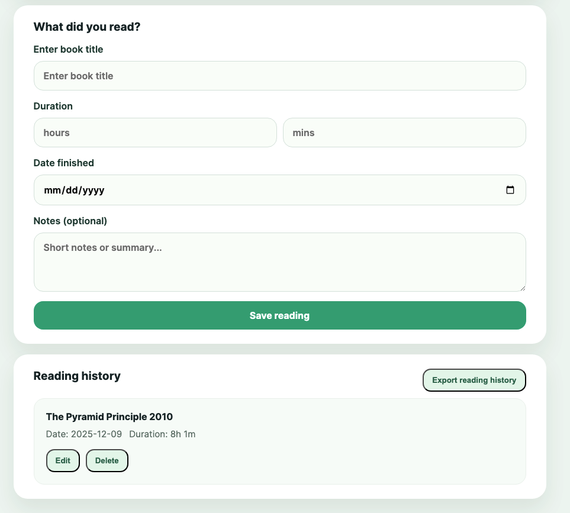

# Reading Tracker

This app was created using **VS Code Agent Mode** and developed through collaborative assistance inside VS Code.

This is a simple reading tracker web application with a Flask backend and a vanilla JavaScript frontend.

## About

- Built with VS Code Agent Mode and developed interactively in VS Code.
- Supports local persistence to `data.json` without requiring a separate database.
- Designed for tracking daily reading check-ins, completed books, and reading duration.

## Functions

- **Daily check-in**: mark whether you read today in the Daily view.
- **Multi-view tracking**: switch between Weekly, Monthly, and Yearly views to see reading status.
- **Yearly heatmap**: Yearly view provides a quick glance at reading activity throughout the year.
- **Book management**: add, edit, and delete book reading records in the Library view.
- **Export history**: export reading dates and book history as CSV files.
- **Local storage**: data is saved in `data.json` so records persist across browser sessions.







## Overview

This app helps you track reading activity in two areas:

- **Daily**: mark whether you read today and browse your reading status in weekly, monthly, or yearly views.
- **Library**: record books you finished, store duration and notes, and export reading history.

## Key features

- Daily check-in button for marking reading completion today
- Weekly / monthly / yearly reading history charts
- Yearly compact heatmap view for long-term tracking
- Book management: add, edit, and delete reading entries
- Export reading dates and book history as CSV
- Persistent data saved locally in `data.json`

## Project structure

- `app.py` — Flask backend serving HTML, API endpoints, and data persistence
- `requirements.txt` — Python dependencies
- `data.json` — stored reading and check-in data
- `templates/index.html` — frontend HTML layout
- `static/styles.css` — app styling
- `static/app.js` — frontend interaction logic
- `static/manifest.json` — PWA metadata
- `static/sw.js` — service worker for offline support
- `static/icon.svg` — app icon

## Install and run

1. Open a terminal.
2. Change to the project folder:

```bash
cd "<path-to-your-local-project-folder>"
```

3. Install dependencies:

```bash
pip install -r requirements.txt
```

4. Start the app:

```bash
python3 app.py
```

5. Open the app in your browser

## Usage

- Click the **Daily** tab to mark today as read and switch between weekly, monthly, and yearly views.
- Click the **Library** tab to add a book record with title, duration, completion date, and optional notes.
- Use the export buttons to download:
  - reading dates from the daily view
  - book history from the library view

## Notes for GitHub

- The app stores all data in `data.json`.
- No database is required; the app is self-contained.
- For best results, open it via Flask, not by loading the HTML file directly.
