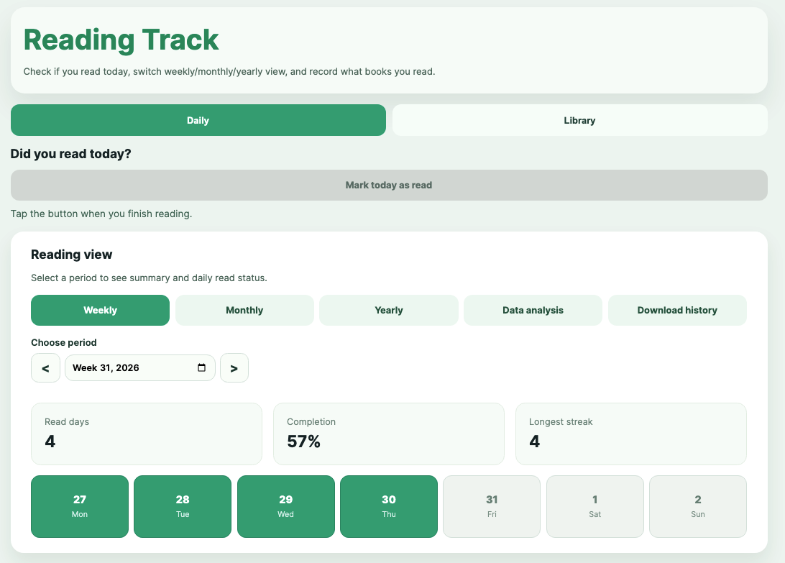
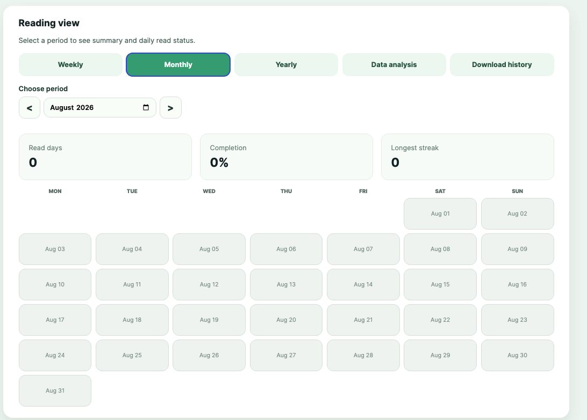
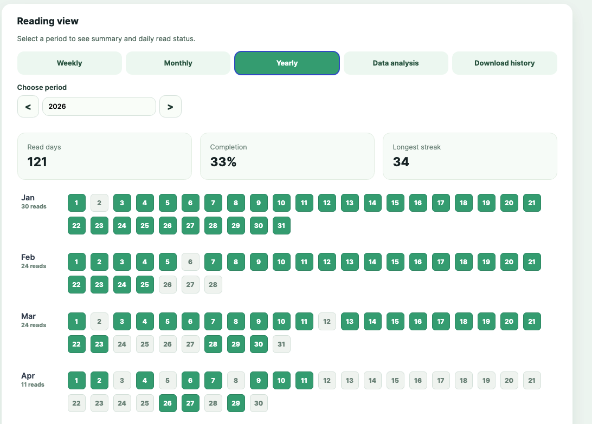
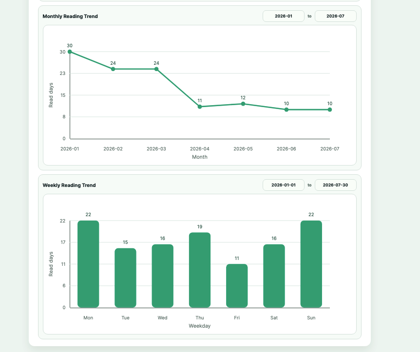
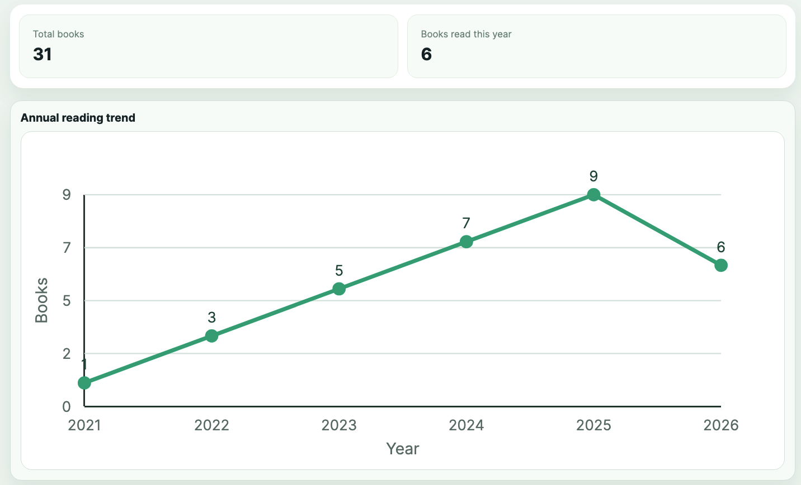
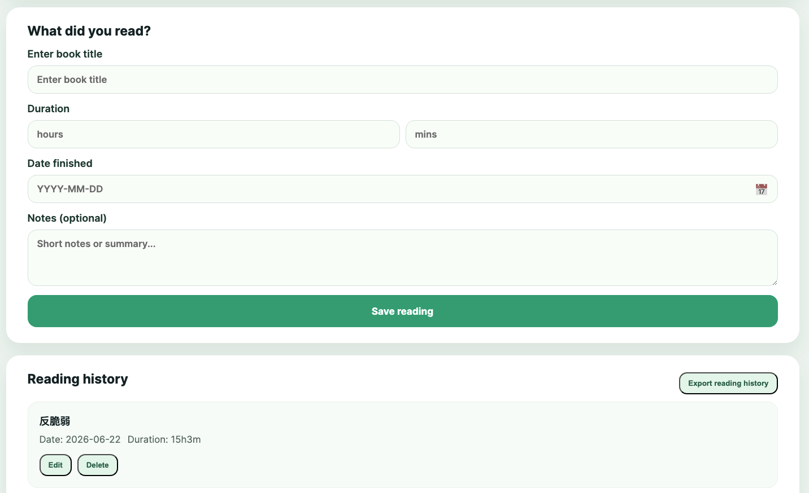

# Reading Tracker

This app was created using **VS Code Agent Mode** and developed through collaborative assistance inside VS Code.
A simple web app for tracking daily reading habits and completed books.

## Key features
- Daily check-in button for marking reading completion today
- Weekly / monthly / yearly reading history views
- Data analysis dashboard with:
  - yearly reading trend line chart
  - monthly reading trend line chart
  - weekday reading trend bar chart
- Library annual reading trend line chart for completed books
- Book management: add, edit, and delete reading entries
- Export reading dates and book history as CSV
- Persistent data saved locally in `data.json`

## Functions

### Reading Views

Check in daily and review reading activity across weekly, monthly, and yearly views.





### Data Analysis

Analyze yearly, monthly, and weekday reading trends with custom date ranges.



### Library and Export

Manage finished books, view annual book trends, and export reading history as CSV files.




## Project structure

- `app.py` — Flask backend serving HTML, API endpoints, and data persistence
- `requirements.txt` — Python dependencies
- `data.json` — stored reading and check-in data
- `templates/index.html` — frontend HTML layout
- `static/styles.css` — app styling
- `static/app.js` — frontend interaction logic
- `static/manifest.json` — PWA metadata
- `static/sw.js` — service worker for offline support
- `static/icon.svg` — app icon

## Install and run
## Run Locally

1. Open a terminal.
2. Change to the project folder:

```bash
cd "<path-to-your-local-project-folder>"
```

3. Install dependencies:

```bash
python3 -m venv .venv
source .venv/bin/activate
pip install -r requirements.txt
python app.py
```

4. Start the app:

```bash
python3 app.py
```
Then open:

5. Open the app in your browser:

If port `5000` is already in use, run the app on another port:
If port `5000` is already in use:

```bash
PORT=5001 python3 app.py
PORT=5001 python app.py
```

## Project Structure

```
.
├── app.py
├── data.json
├── requirements.txt
├── templates/
│   └── index.html
├── static/
│   ├── app.js
│   ├── styles.css
│   ├── manifest.json
│   ├── sw.js
│   └── icon.svg
└── screenshots/
```
