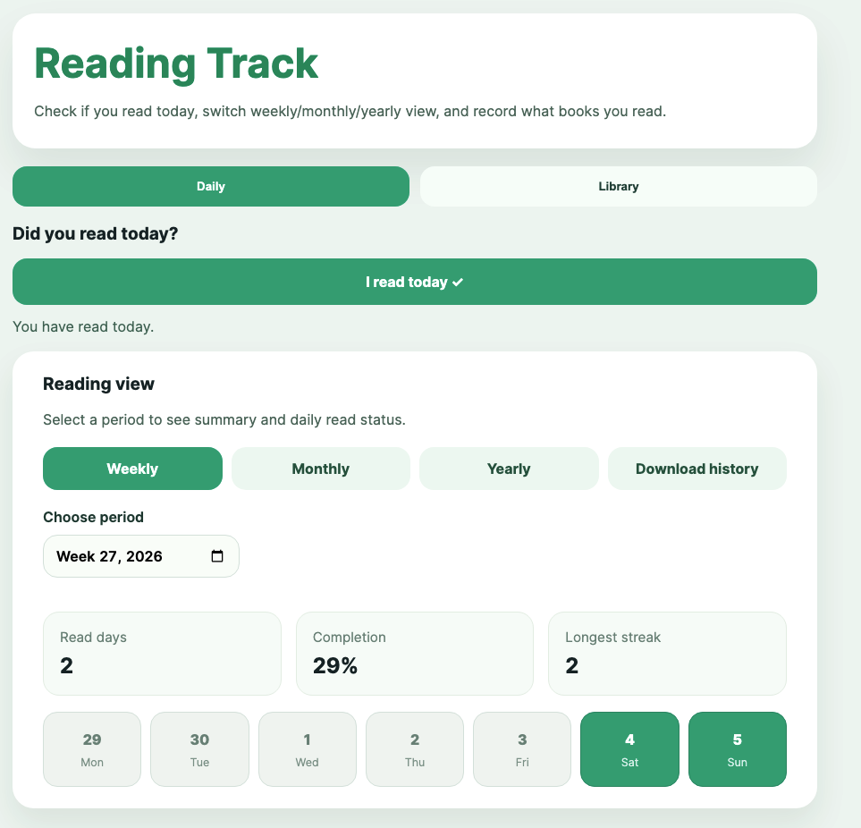

# Reading Tracker

A simple reading tracker web app built with **VS Code Agent Mode**.

This project was created and iterated through Agent Mode collaboration, from the Flask backend to the interactive frontend views and data visualizations.

## Features

- Daily reading check-in
- Weekly, monthly, and yearly reading views
- Monday-first monthly calendar layout
- Yearly reading overview with monthly read-count summaries
- Data analysis charts for yearly, monthly, and weekday reading trends
- Book library for finished books, reading duration, dates, and notes
- Annual book trend chart
- CSV export for reading dates and book history
- Local data persistence with `data.json`

## Screenshots




## Tech Stack

- Flask
- Vanilla JavaScript
- HTML/CSS
- Local JSON storage

## Run Locally

```bash
python3 -m venv .venv
source .venv/bin/activate
pip install -r requirements.txt
python app.py
```

Open:

```text
http://127.0.0.1:5000
```

If port `5000` is already in use:

```bash
PORT=5001 python app.py
```

## Project Structure

- `app.py` - Flask backend and API routes
- `templates/index.html` - main app page
- `static/app.js` - frontend logic and charts
- `static/styles.css` - app styling
- `data.json` - local reading data

## Note

This is a local-first project. Data is saved in `data.json`, so no external database is required.

Personal reading data is intentionally not included in the repository. Use `data.example.json` as the starter format.
